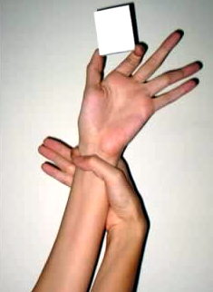

# El sistema óseo

Los huesos y ligamentos se ven afectados en muchas y distintas formas. Un individuo con síndrome de Marfan frecuentemente será alto, delgado y muy flexible. Esta flexibilidad se extiende hasta los pies y tobillos, que con frecuencia carecen de arco \(pes planus\), rotación interna \(pronación\), o ambas. Los brazos, las piernas y los dedos pueden ser desproporcionadamente largos al compararlos con el tórax. La curvatura lateral de la columna vertebral vista de frente \(escoliosis\) es anormal, es frecuente y puede llegar a ser bastante severa si no se trata.

La columna vertebral vista lateralmente, presenta varias curvas en forma de S. Las personas con síndrome de Marfan pueden llegar a tener una o varias de estas curvas más pronunciadas de lo normal.

El hueso del pecho \(esternón\) puede sobresalir \(comúnmente llamado pecho de paloma o “pectus carinatum”\) o puede estar hundido \(pecho en embudo o “pectus excavatum”\), debido a un mayor desarrollo de las costillas. El paladar está generalmente muy arqueado y los dientes apiñados. La mandíbula inferior por lo general está hacia atrás \(retrógnata\), lo que propicia una maloclusión. La cara puede parecer larga y delgada, siguiendo la forma general del cuerpo

