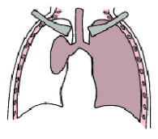

# Los pulmones

Los pulmones pueden verse afectados de varias maneras: el tejido conectivo es importante para dar estabilidad y elasticidad a los pequeños sacos de aire \(alvéolos\) en los pulmones.

Casi todos los que padecen Síndrome de Marfan han perdido elasticidad cuando se les compara con personas del mismo sexo, edad, estructura física y con los que fuman. Sin embargo, esto raramente causa algún problema notable.

Por lo regular, las personas con síndrome de Marfan no son más susceptibles a los problemas de pulmones como asma, neumonía o bronquitis, que la población en general. Algunas personas con Marfan desarrollan enfisema aún sin ser fumadores.

El colapso espontáneo del pulmón \(neumotórax\) ocurre en aproximadamente en uno de cada 20 casos con síndrome de Marfan, aproximadamente 50 veces más que en la población en general. Esto puede ocurrir inesperadamente, o después de un simple golpe en el pecho. Los síntomas son una sensación de falta de aire, acompañada de dolor en pecho, que puede ser agudo o moderado y puede modificarse con la respiración.

Este es siempre un problema que requiere inmediata atención, pero que rara vez es una amenaza para la vida. Este problema debería ser un fuerte incentivo para que las personas con síndrome de Marfan eviten por completo fumar.

Se ha detectado que algunas personas con síndrome de Marfan tienen problemas con la respiración durante el sueño, esto puede ocurrir por diferentes causas. Una podría ser la laxitud del tejido conectivo de las vías aéreas, que se relajan todavía más durante el sueño, y causan una obstrucción parcial al paso del aire.

El síntoma más común de esta alteración del sueño es el ronquido. Sin embargo, este tema no se ha estudiado con detalle hasta la actualidad.

