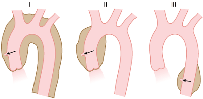

# Tratamiento del corazón y la aorta

El sistema cardiovascular, por sus complicaciones, puede ser fatal, lógicamente esto provoca una mayor atención tanto del paciente como del médico en cuanto a su control. Aquí también, la primera línea de defensa está en la evaluación rutinaria. Sólo a través de un control regular y de ecocardiogramas se pueden evaluar la función y el tamaño del corazón y de la aorta, antes de que surjan problemas serios. El riesgo es grande si se espera a que aparezcan algunos síntomas. Para los que no tienen problemas cardiovasculares tan serios, es adecuada una evaluación anual. La detección de soplos en el corazón o del crecimiento de la aorta son indicativos de visitas médicas más frecuentes. Ocasionalmente, la irregularidad de los latidos del corazón requiere de tratamiento con medicamentos. Si el funcionamiento de una de las válvulas del corazón falla, en su inicio puede ser tratado con medicamentos. Si la función sigue deteriorándose, será necesaria una cirugía para repararla o reemplazarla por una artificial. Si la válvula permite el reflujo de sangre es porque está muy dilatada; la terapia quirúrgica actual consiste en el cambio de la válvula y de varios centímetros de la aorta, por un trasplante completo con injerto compuesto: una válvula artificial unida a un extremo de tubo de tela. Los resultados han sido tan exitosos que la mayoría de los médicos la recomiendan a ciertos pacientes con el fin de prevenir cualquier deterioro súbito. El seleccionar a los pacientes que requieren de esta cirugía preventiva se basa en el diámetro de la aorta; más de 55 mm. en una adulto, es una pauta. Después del remplazo de la válvula, el paciente debe tomar durante toda su vida un medicamento anticoagulante. Este medicamento es para reducir las posibilidades de que se formen coágulos de sangre en la válvula artificial. Muchos factores, incluyendo el alcohol, la dieta y otros medicamentos, pueden alterar el efecto del anticoagulante. Por esto, es necesario efectuar periódicamente un análisis de sangre \(mensual\) y asegurar la efectividad del tratamiento. Cuando algunas personas no toleran los anticoagulantes, la raíz de la aorta y la válvula pueden ser reemplazados por tejido humano preservado \(injerto homólogo\). Esto da al paciente la oportunidad de no tomar anticoagulantes, pero por otro lado, el injerto sólo dura entre 10 y 15 años y tendrá que remplazarse. La práctica de estas dos técnicas está creciendo en Estados Unidos y en el mundo. Se recomiendan a los pacientes que necesitan esta clase de cirugía, acudir a centros médicos que tengan experiencia en el tratamiento del síndrome de Marfan. Se está estudiando un nuevo método para reparar la raíz de la aorta dilatada en pacientes del síndrome de Marfan. Esto es emocionante porque se trata de preservar la válvula aórtica del paciente. Entre otras ventajas de este método estría la de que el paciente no necesita tomar anticoagulantes y el riesgo de una infección \(endocarditis\) se reduce considerablemente.

Este enfoque quirúrgico no es apropiado para todos, especialmente para aquellos que tienen una válvula aórtica muy dañada, o una extensa disección de la raíz de la aorta. Varios centros de Estados Unidos y de Europa están adquiriendo y compartiendo experiencias relacionadas con la técnica del injerto, por lo que en pocos años será posible realizarla comúnmente.

Dadas las anomalías del corazón, cualquier persona afectada por el síndrome de Marfan corre un riesgo mayor de infecciones en las válvulas \(endocarditis\). Algunos procedimientos como la extracción de dientes u operaciones en los sistemas genital y urinario, tienden a introducir bacterias en la corriente sanguínea. Si se toman antibióticos 6 horas antes del procedimiento, se reduce efectivamente el riesgo de una infección. Se recomiendan la penicilina y ampicilina, y para aquellos alérgicos a la penicilina, la eritromicina la puede sustituir. Los adultos deben tomar 1.000 mg oral de amoxicilina una hora antes de una limpieza dental o de una extracción. Los niños entre 5 y 12 años deben tomar la mitad de estas dosis. Los niños menores de esta edad deberán ser prescritos por el pediatra. Las personas que tienen válvula artificial requieren dosis más altas de antibióticos, que se aplican vía intravenosa o intramuscular.

Algunas personas necesitan cirugía en regiones de la aorta más allá de los primeros 10 mm. Cualquier parte de la aorta se puede reparar. Si no existe disección de aorta en el momento inicial en el que se repara la raíz de la aorta con el injerto, las probabilidades de que se requiera otra cirugía de la aorta en el futuro son mínimas. Sin embargo, es necesario un seguimiento a largo plazo para poder contestar esta importante pregunta con más seguridad. El procedimiento preferido para seguir la evolución de los post-operatorios es la resonancia magnética de la aorta. En el pasado existía la preocupación de cómo se iba a comportar la prótesis de la válvula, ya que el campo magnético de la resonancia es muy fuerte. Ahora se sabe que no hay peligro de ningún tipo para la válvula o el paciente. La razón más frecuente por la cual no se realiza una resonancia magnética a un paciente con síndrome de Marfan es porque éste tiene un marcapasos.

Existe un grupo de fármacos llamados beta-bloqueantes adrenérgicos que se prescriben para regular la presión sanguínea y el ritmo cardiaco. Dos de estos medicamentos: propanolol \(Inderalici\) y atenolol \(Tenormin\) son útiles para el tratamiento de los problemas cardiovasculares en el síndrome de Marfan. Ambos reducen la fuerza y la frecuencia del corazón, lo que reduce el esfuerzo de la aorta. Estudios recientes han demostrado que el propanolol retarda el ritmo de agrandamiento de la raíz de la aorta en niños y adultos con este síndrome. Ambos medicamentos producen pocos efectos secundarios y retrasan o evitan la necesidad de la cirugía. La dosis debe ser individualizada y la terapia debe estar cuidadosamente controlada, principalmente, al principio.

Hay algunas personas que no pueden tomar beta-bloqueantes, por ello se están realizando estudios para encontrar alternativas efectivas. A las personas que tienen insuficiencia mitral se les pueden prescribir otro tipo de fármacos, como son los inhibidores de la enzima angiotensina, el ejemplo sería el enalopril \(Vasotec\).

Todos los pacientes de Marfan deben evitar alzar objetos pesados, hacer ejercicios isométricos \(esfuerzo que se ejerce sobre una resistencia inmóvil\) o realizar ejercicios que exijan abusar de su capacidad física debido al esfuerzo extra que se le exige a la aorta y al sobresfuerzo que efectúa el corazón. Asimismo, dado que la pared de la aorta es más débil de lo normal, deben evitarse los deportes en los que hay contacto físico, como el rugby y el baloncesto.

Estas indicaciones, frecuentemente representan el aspecto más difícil de controlar, particularmente para la gente joven y por cualquiera que está acostumbrado a trabajos pesados o ejercicios vigorosos o de contacto.

Algunas veces, se deben hacer cambios drásticos en el estilo de vida para preservar la salud. Es más fácil encauzar la atención de los niños hacia actividades que no requieren esfuerzo, que decirle a un joven que debe abandonar el baloncesto o cualquier otra actividad de competición. A parte de esto, son poco frecuentes los casos en que los niños necesitan restricciones en sus actividades y juegos cotidianos.

