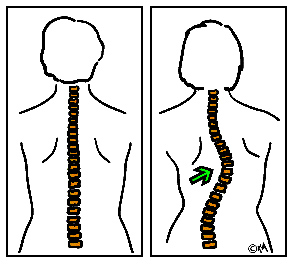
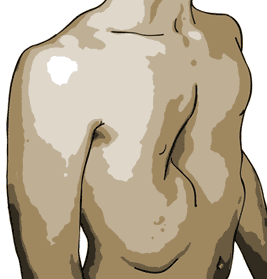

# Tratamiento del sistema óseo

En el sistema óseo, la curvatura de la columna vertebral y la deformidad del pecho, representan los problemas más serios y pueden desfigurar o alterar la función del corazón y los pulmones.

Con respecto a la columna, el primer paso a dar es efectuar una evaluación rutinaria anualmente, hecha por un médico que comprenda los problemas potenciales de este trastorno, como un ortopedista. Si se observa una curvatura anormal de la columna, \(escoliosis\), las radiografías son útiles para medir el ángulo de la curvatura.

Las curvaturas anormales tienden a empeorar durante el periodo de crecimiento, particularmente en la pubertad. Una vez que se observe una curvatura de más de 10 grados, el cirujano ortopedista especialista en columna deberá unirse al equipo de control del paciente. Un corsé que se puede quitar y poner es frecuentemente efectivo para estabilizar la columna hasta que se complete el crecimiento. Si el corsé no es efectivo y la o las curvaturas empeoran a más de 40 grados \(la curvatura tiende a empeorar a lo largo de la vida\), se debe considerar la posibilidad de cirugía.

Existen varios procedimientos quirúrgicos que obtienen resultados satisfactorios y seguros que estabilizan la columna y que frecuentemente la hacen volver a su curvatura normal. Dado que la cirugía implica incomodidad y el uso de una escayola durante varios meses, está recomendada sólo como último recurso. Un tratamiento cuidadoso reduce enormemente la posibilidad de una cirugía. Algunos niños han sido tratados con hormonas para adelantar el comienzo de la pubertad a fin de acelerar el ciclo de crecimiento y reducir la cantidad de años durante los cuales la columna puede deformarse. Este tratamiento ha sido más efectivo en las niñas, en las que los efectos secundarios han sido mínimos. La altura del adulto se reduce debido a este tratamiento, pero el niño o niña tiene que enfrentarse a los juicios psicológicos y sociales por madurar sexualmente antes que sus compañeros. La mayoría de las niñas se han adaptado bien a este tratamiento. El tratamiento hormonal para modular el crecimiento debe ser supervisado por un pediatra endocrinólogo o un genetista.

Ambas deformidades del tórax, el pecho excavado o el prominente, pueden ser corregidas quirúrgicamente.

Dado que la deformidad se produce por un excesivo crecimiento de las costillas, el hueso del pecho \(esternón\) puede ser deformado hacia adentro o hacia fuera si la cirugía se realiza antes de que las costillas terminen de crecer. Por esta razón, se recomienda que las correcciones de las deformidades del pecho por razones de estética se lleven a cabo a mediados de la adolescencia. Algunas veces, si el corazón o el pulmón están severamente comprimidos, la corrección debe realizarse en la infancia.

Los otros problemas óseos raramente requieren de un tratamiento extensivo. Los pies planos, largos y delgados requieren una atención cuidadosa en la selección del calzado adecuado que de soporte y estabilidad. Las articulaciones laxas entorpecen el paso al caminar en la infancia o pueden conducir a la dislocación de las articulaciones, particularmente de la rótula en la rodilla. Generalmente, a medida que el niño o la niña crece, las articulaciones desarrollan mayor estabilidad y los músculos que las rodean generan la fuerza necesaria para minimizar estos problemas.

A medida que las personas con síndrome de Marfan se hacen adultos. y se mantienen físicamente activos, las articulaciones que antes tenían hiperelasticidad, tienden a desarrollar artritis degenerativa. Los principales síntomas son disminución de movimiento en la articulación afectada, dolor que se incrementa con el movimiento de la articulación e inflamación y calor esporádicos alrededor de la articulación. Un reumatólogo o un ortopedista pueden ser de mucha ayuda para establecer un cuidado/tratamiento a largo plazo.

